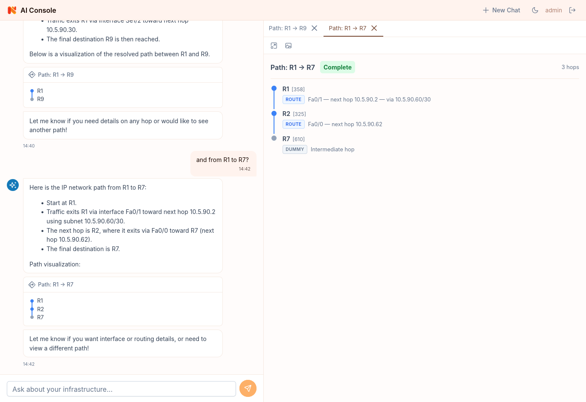
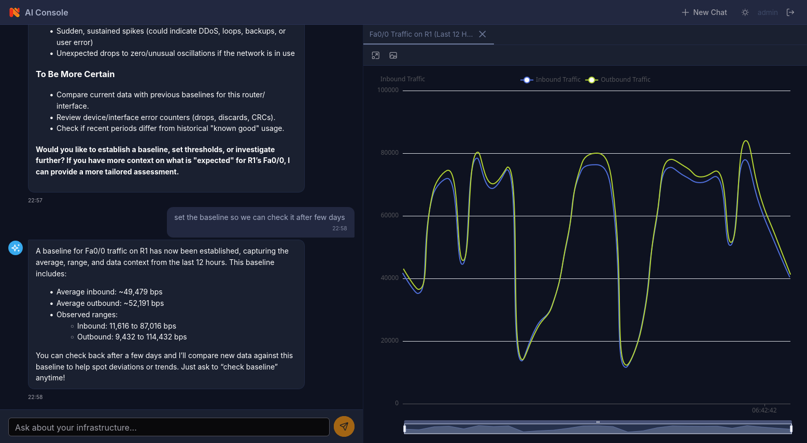

# NetXMS AI Console

An AI-powered web console for [NetXMS](https://www.netxms.org/) infrastructure monitoring. Instead of navigating menus and dashboards, users interact through natural language — the AI queries objects, metrics, alarms, and events, then responds with rich inline visualizations.

## Screenshots





_Chat interface with inline chart previews on the left, full interactive visualization panel on the right._

## Features

- **Conversational interface** — ask questions about your infrastructure in plain English
- **Rich visualizations** — line/area charts, bar/pie charts, gauges, tables, heatmaps, sparkline grids, network topology maps, geographic maps, and route traces rendered inline and in a tabbed side panel
- **DCI charts** — server-side rendered Data Collection Item charts for historical metric data
- **Network topology** — interactive node-link diagrams for visualizing infrastructure relationships
- **Geographic maps** — Leaflet-based maps for plotting objects by location
- **Heatmaps** — time-based heatmap grids for spotting patterns across nodes and periods
- **Sparkline grids** — compact multi-metric overview with miniature trend lines
- **Interactive charts** — zoom, tooltips, data zoom slider, threshold lines
- **Tables with filtering** — sortable, paginated, with global text filter and severity badges
- **Visualization toolbar** — fullscreen, PNG export, CSV copy
- **Dark mode** — toggleable dark/light theme with OS preference detection
- **Localization** — English, German, and Arabic (right-to-left) UI with a language switch in the header
- **Pending questions** — the AI can ask for confirmation or offer multiple-choice options mid-conversation
- **XSS protection** — sanitized Markdown rendering

## Prerequisites

- **Node.js** 20.19+ or 22.12+
- **Yarn** package manager
- A running **NetXMS server** (6.1+) with web API enabled

## Quick Start

```bash
# Install dependencies
yarn install

# Start dev server (proxies API to NetXMS server)
yarn dev
```

The app runs at `http://localhost:5174`. The dev server proxies `/api` requests to the NetXMS WebAPI server.

### Configuration

Create a `.env.local` file to override defaults:

```env
# NetXMS server URL for dev proxy
VITE_API_TARGET=https://your-netxms-server.example.com

# Application base path (default: /)
VITE_BASE_URL=/

# API base path (default: /api)
VITE_API_BASE_URL=/api
```

### Production Build

```bash
yarn build
```

To build for deployment under path other than /:
```bash
VITE_BASE_URL=/path yarn build
```

Output goes to `dist/`. Serve with any static file server. In production, configure your reverse proxy to forward `/api` requests to the NetXMS WebAPI.

## Tech Stack

- [Vue 3](https://vuejs.org/) — Composition API with `<script setup>`
- [PrimeVue 4](https://primevue.org/) — UI component library (Aura theme)
- [ECharts](https://echarts.apache.org/) via [vue-echarts](https://github.com/ecomfe/vue-echarts) — charts, gauges, and heatmaps
- [Leaflet](https://leafletjs.com/) — geographic maps
- [vis-network](https://visjs.github.io/vis-network/) — network topology diagrams
- [Pinia](https://pinia.vuejs.org/) — state management
- [marked](https://marked.js.org/) — Markdown rendering
- [DOMPurify](https://github.com/cure53/DOMPurify) — HTML sanitization
- [Vite](https://vite.dev/) — build tool

## Architecture

```
┌───────────────────────────────────────────────────────┐
│                 AI Console (Vue 3 SPA)                │
│                                                       │
│  ┌─────────────────────┐  ┌────────────────────────┐  │
│  │    Chat Panel       │  │  Visualization Panel   │  │
│  │                     │  │  (tabbed)              │  │
│  │  Messages + inline  │  │  Full interactive      │  │
│  │  viz previews       │  │  charts/tables/gauges  │  │
│  │                     │  │                        │  │
│  │  [Chat Input]       │  │  [Toolbar]             │  │
│  └─────────────────────┘  └────────────────────────┘  │
└─────────────────────────┬─────────────────────────────┘
                          │ REST/JSON (polling)
                    ┌─────┴──────┐
                    │  NetXMS    │
                    │  Server    │
                    │  WebAPI    │
                    └────────────┘
```

The chat panel takes full width when no visualizations are open. When a visualization is created, the view splits into a 45/55 layout with the visualization panel appearing on the right.

## License

This project is part of [NetXMS](https://www.netxms.org/) and is licensed under the GNU General Public License v3.
